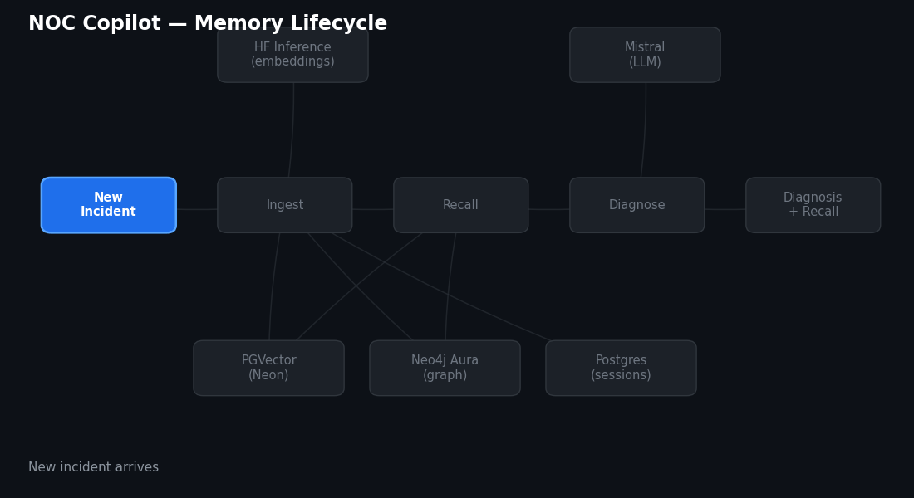
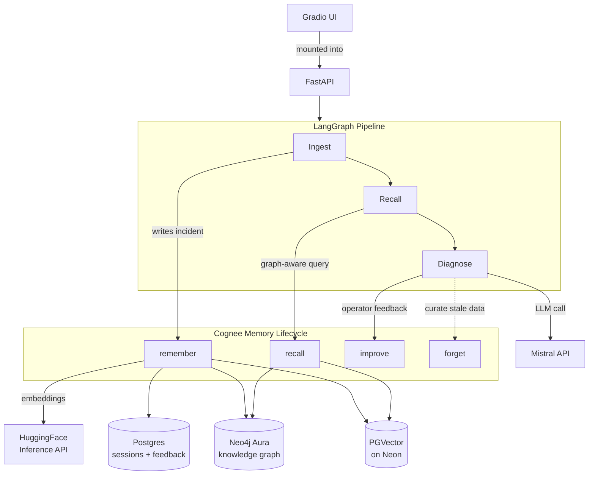
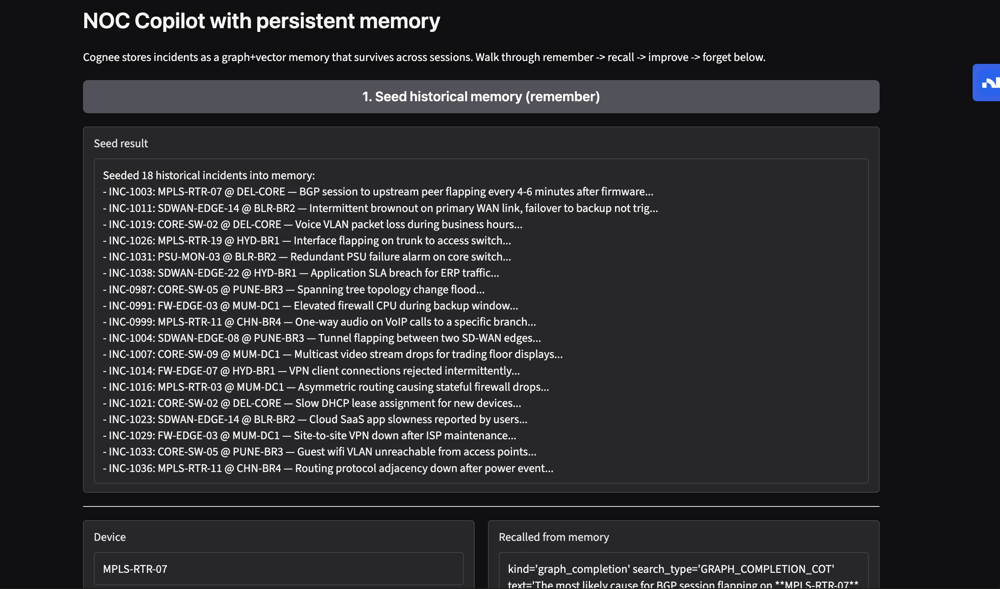
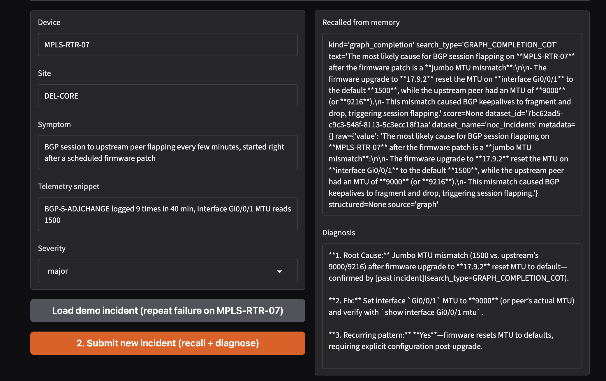
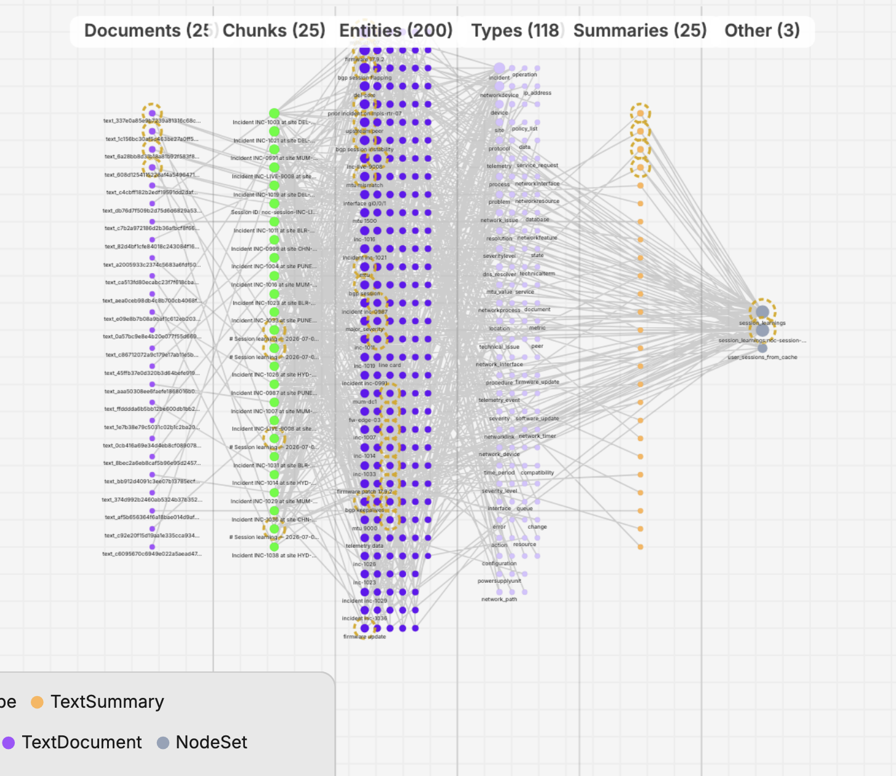

<div align="center">

# NOC Copilot

### A network incident assistant that remembers, instead of diagnosing everything cold

[](https://github.com/topoteretes/cognee)
[](https://github.com/langchain-ai/langgraph)
[](https://neo4j.com/cloud/aura/)
[](https://github.com/pgvector/pgvector)
[](https://www.python.org/)
[](LICENSE)

[](https://render.com/deploy)

</div>

---

## The problem

LLM agents are stateless. Close the session, and everything's gone. For a
NOC copilot, that's not a minor inconvenience — if the same router flapped
three weeks ago and got fixed a specific way, an agent that can't recall
that is useless the second time it happens.

**NOC Copilot** wires [Cognee](https://github.com/topoteretes/cognee) in as
a real graph-vector memory layer, so incident diagnosis gets sharper over
time instead of starting from zero every session.

<p align="center">
  
</p>

---

## Table of contents

- [How it works](#how-it-works)
- [Architecture](#architecture)
- [Tech stack](#tech-stack)
- [The demo, in screenshots](#the-demo-in-screenshots)
- [Quick start](#quick-start)
- [Deploy](#deploy)
- [Lessons learned](#lessons-learned-the-hard-way)

---

## How it works

<details open>
<summary><b>Four memory verbs, not two</b></summary>
<br>

Most memory demos only show write-and-retrieve. This uses all four verbs
Cognee exposes:

| Verb | What it does here |
|---|---|
| **`remember`** | Every incident gets written into permanent graph + vector memory |
| **`recall`** | A new incident triggers a graph-aware query — walks shared entities (device, site, failure pattern), not just text similarity |
| **`improve`** | An operator rates a diagnosis correct/incorrect; that feedback reweights the graph so future recall favors what actually worked |
| **`forget`** | A stale or superseded incident can be deleted from the graph + vector store outright — memory here is curated, not append-only |

</details>

<details>
<summary><b>The 30-second story that proves it's not faked</b></summary>
<br>

18 historical incidents are seeded across 13 devices and 6 sites — a real
haystack, not a handful of curated examples. One of them, `INC-1003`, was a
BGP session flapping on router `MPLS-RTR-07`, caused by an MTU mismatch
after a firmware upgrade, three weeks ago.

A *new* incident comes in: same router, same symptom, after another
firmware patch. The agent recalls `INC-1003` specifically — out of the
other 17 — via graph traversal, and flags it as a likely repeat instead of
re-deriving the diagnosis from scratch.

If you're skeptical this could be faked with a big prompt: kill the
process after seeding, restart it fresh, and recall still works. Nothing
about these 18 incidents lives in a conversation or a process — it's on
disk (well, in Postgres and Neo4j), outside any LLM's context window
entirely.

</details>

---

## Architecture



<details>
<summary><b>Why three separate databases, not one</b></summary>
<br>

Cognee actually has three storage layers, easy to miss two of them:

1. **Vector store** (PGVector) — semantic similarity search
2. **Graph store** (Neo4j) — entity relationships, what `recall` actually walks
3. **Relational store** (Postgres) — Cognee's own bookkeeping: datasets, sessions, feedback

All three default to local disk if left unconfigured, which works fine
locally but silently loses everything on a redeploy. All three point at
managed services here specifically so the "memory survives across
sessions" claim is true in production, not just in a local demo.

</details>

---

## Tech stack

| Layer | Choice |
|---|---|
| Agent orchestration | LangGraph |
| Memory | Cognee (`remember` / `recall` / `improve` / `forget`) |
| LLM | Mistral (via litellm) |
| Embeddings | HuggingFace Inference API (`bge-large-en-v1.5`) |
| Vector storage | PGVector on Neon |
| Graph storage | Neo4j Aura |
| Relational storage | Postgres (Neon) |
| Backend | FastAPI |
| UI | Gradio, mounted into the same FastAPI process |
| Deployment | Render (single service) |

---

## The demo, in screenshots

<table>
<tr>
<td width="33%">

**1. Seed memory**



</td>
<td width="33%">

**2. Recall + diagnose**



</td>
<td width="33%">

**3. Visualize the graph**



</td>
</tr>
</table>

---

## Quick start

<details>
<summary>Click to expand setup steps</summary>
<br>

```bash
git clone <your-repo-url>
cd noc-copilot
pip install -r requirements.txt
cp .env.example .env
# fill in .env: LLM_API_KEY, EMBEDDING_API_KEY, VECTOR_DB_*, GRAPH_DATABASE_*, DB_*
```

Smoke test first, no API calls, no keys required:

```bash
python -m pytest tests/test_smoke.py -v
```

Seed memory, then run:

```bash
python scripts/seed_memory.py
uvicorn app.api:app --host 0.0.0.0 --port 8000
```

Open `http://localhost:8000` — the Gradio UI and the API routes
(`/seed`, `/incident`, `/rate`, `/forget`, `/graph`) are served together,
one process.

</details>

---

## Deploy

<details>
<summary>Click to expand Render deployment</summary>
<br>

This repo includes a `render.yaml` blueprint. On Render: **New → Blueprint**,
point it at this repo. It auto-detects the build/start commands and prompts
for every credential (LLM key, embedding key, and all Postgres/Neo4j
connection details) — nothing sensitive is stored in the committed file.

</details>

---

## Lessons learned the hard way

<details>
<summary>Click to expand — the debugging saga, kept honest</summary>
<br>

- **A community vector adapter silently downgraded Cognee** from 1.2.2 to
  0.5.6 as a pinned dependency, deleting the entire `remember`/`recall`/
  `improve`/`forget` API this project is built on. Caught it by checking
  `hasattr(cognee, "remember")` after install, before it broke anything
  downstream.
- **Neo4j Aura doesn't always use `neo4j` as the username.** Some
  instances issue a per-instance ID (e.g. `02edf51a`) as both the username
  *and* the database name. Hours of `Unauthorized` errors traced back to
  assuming a default that wasn't universal — the fix was reading the
  instance's own downloaded credentials file instead of assuming.
- **`self_improvement=True` is the default on every `remember()` call**,
  triggering a full-graph LLM consolidation pass on every single write.
  Fine for one incident, brutal for seeding eighteen sequentially. Turned
  it off for bulk writes, kept it explicit and deliberate in the feedback
  loop instead.

</details>

---

<div align="center">

Built for the [WeMakeDevs Cognee Hackathon](https://wemakedevs.org/) — "The Hangover Part AI"

</div>
